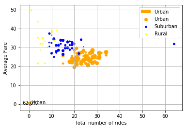
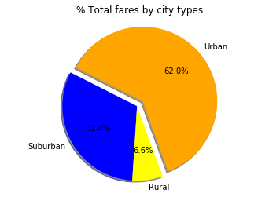
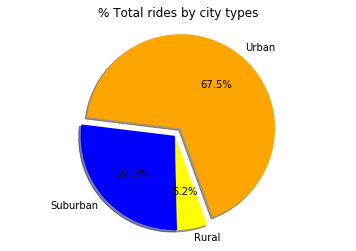
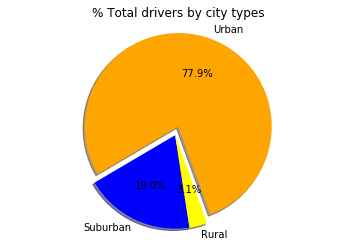

```python
# importing libraries
import pandas as pd
import matplotlib.pyplot as plt
import numpy as np
from pylab import *
from scipy import *
```


```python
# importing csv
city_df = pd.read_csv("raw_data\city_data.csv")
ride_df = pd.read_csv("raw_data/ride_data.csv")
# merging two dfs for easier use
data = city_df.merge(ride_df, on="city")
data.head()
```


<div>
<style>
    .dataframe thead tr:only-child th {
        text-align: right;
    }

    .dataframe thead th {
        text-align: left;
    }

    .dataframe tbody tr th {
        vertical-align: top;
    }
</style>
<table border="1" class="dataframe">
  <thead>
    <tr style="text-align: right;">
      <th></th>
      <th>city</th>
      <th>driver_count</th>
      <th>type</th>
      <th>date</th>
      <th>fare</th>
      <th>ride_id</th>
    </tr>
  </thead>
  <tbody>
    <tr>
      <th>0</th>
      <td>Kelseyland</td>
      <td>63</td>
      <td>Urban</td>
      <td>2016-08-19 04:27:52</td>
      <td>5.51</td>
      <td>6246006544795</td>
    </tr>
    <tr>
      <th>1</th>
      <td>Kelseyland</td>
      <td>63</td>
      <td>Urban</td>
      <td>2016-04-17 06:59:50</td>
      <td>5.54</td>
      <td>7466473222333</td>
    </tr>
    <tr>
      <th>2</th>
      <td>Kelseyland</td>
      <td>63</td>
      <td>Urban</td>
      <td>2016-05-04 15:06:07</td>
      <td>30.54</td>
      <td>2140501382736</td>
    </tr>
    <tr>
      <th>3</th>
      <td>Kelseyland</td>
      <td>63</td>
      <td>Urban</td>
      <td>2016-01-25 20:44:56</td>
      <td>12.08</td>
      <td>1896987891309</td>
    </tr>
    <tr>
      <th>4</th>
      <td>Kelseyland</td>
      <td>63</td>
      <td>Urban</td>
      <td>2016-08-09 18:19:47</td>
      <td>17.91</td>
      <td>8784212854829</td>
    </tr>
  </tbody>
</table>
</div>


```python
city_groups = data.groupby(["city"])
# Making 
cities_rides_data = pd.DataFrame()
for city, info in city_groups:
    city_ride_data = pd.DataFrame({
        
        "Average Fare": [info["fare"].mean()], 
        "Total number of rides": [info["ride_id"].count()],
        "Total numbers of driver":[info["driver_count"].values[0]],
        "City types" : [info["type"].values[0]],
        "Total Fare" : [info["fare"].sum()]
        
    })
    cities_rides_data= cities_rides_data.append(city_ride_data)
print (cities_rides_data.head())
```

       Average Fare City types  Total Fare  Total number of rides  \
    0     23.928710      Urban      741.79                     31   
    0     20.609615      Urban      535.85                     26   
    0     37.315556   Suburban      335.84                      9   
    0     23.625000      Urban      519.75                     22   
    0     21.981579      Urban      417.65                     19   
    
       Total numbers of driver  
    0                       21  
    0                       67  
    0                       16  
    0                       21  
    0                       49  
    


```python
#grouping through city types
urban_df = cities_rides_data.loc[cities_rides_data["City types"] == "Urban"]
suburban_df = cities_rides_data.loc[cities_rides_data["City types"] == "Suburban"]
rural_df = cities_rides_data.loc[cities_rides_data["City types"] == "Rural"]
urban_df.head()
```


<div>
<style>
    .dataframe thead tr:only-child th {
        text-align: right;
    }

    .dataframe thead th {
        text-align: left;
    }

    .dataframe tbody tr th {
        vertical-align: top;
    }
</style>
<table border="1" class="dataframe">
  <thead>
    <tr style="text-align: right;">
      <th></th>
      <th>Average Fare</th>
      <th>City types</th>
      <th>Total Fare</th>
      <th>Total number of rides</th>
      <th>Total numbers of driver</th>
    </tr>
  </thead>
  <tbody>
    <tr>
      <th>0</th>
      <td>23.928710</td>
      <td>Urban</td>
      <td>741.79</td>
      <td>31</td>
      <td>21</td>
    </tr>
    <tr>
      <th>0</th>
      <td>20.609615</td>
      <td>Urban</td>
      <td>535.85</td>
      <td>26</td>
      <td>67</td>
    </tr>
    <tr>
      <th>0</th>
      <td>23.625000</td>
      <td>Urban</td>
      <td>519.75</td>
      <td>22</td>
      <td>21</td>
    </tr>
    <tr>
      <th>0</th>
      <td>21.981579</td>
      <td>Urban</td>
      <td>417.65</td>
      <td>19</td>
      <td>49</td>
    </tr>
    <tr>
      <th>0</th>
      <td>25.106452</td>
      <td>Urban</td>
      <td>778.30</td>
      <td>31</td>
      <td>41</td>
    </tr>
  </tbody>
</table>
</div>


```python
# cities_rides_data.plot.scatter(x="Total number of rides", y= "Average Fare",color=["orange", "blue", "yellow"], s=cities_rides_data["Total numbers of driver"], label=["City types"])
# suburban_df.plot.scatter(x="Total number of rides", y= "Average Fare",color="blue", s=cities_rides_data["Total numbers of driver"], label="Suburban")
# rural_df.plot.scatter(x="Total number of rides", y= "Average Fare",color="yellow", s=cities_rides_data["Total numbers of driver"], label="Rural")

plt.scatter(urban_df["Total number of rides"], urban_df["Average Fare"], color="orange",s=urban_df["Total numbers of driver"], label="Urban")
plt.scatter(suburban_df["Total number of rides"], suburban_df["Average Fare"], color="blue", s=suburban_df["Total numbers of driver"], label="Suburban")
plt.scatter(rural_df["Total number of rides"], rural_df["Average Fare"], color="yellow", s=rural_df["Total numbers of driver"], label="Rural")

plt.xlabel("Total number of rides")
plt.ylabel("Average Fare")
plt.grid(True)
plt.legend(loc="upper right")
plt.show()
```





```python
# % of Total Fares by City Type
total_fares = [urban_df["Total Fare"].sum(), suburban_df["Total Fare"].sum(), rural_df["Total Fare"].sum()]
explode = [0.1, 0, 0]
plt.pie(total_fares, labels=["Urban", "Suburban", "Rural"], 
        colors=["orange", "blue", "yellow"], autopct="%1.1f%%", shadow=True, explode=explode, startangle=290)
plt.title("% Total fares by city types")
plt.axis("equal")
plt.show()
```





```python
# of Total rides by City Type
total_rides = [urban_df["Total number of rides"].sum(), suburban_df["Total number of rides"].sum(), rural_df["Total number of rides"].sum()]
explode = [0.1, 0, 0]
plt.pie(total_rides, labels=["Urban", "Suburban", "Rural"], 
        colors=["orange", "blue", "yellow"], autopct="%1.1f%%", shadow=True, explode=explode, startangle=290)
plt.title("% Total rides by city types")
plt.axis("equal")
plt.show()
```





```python
#Total drivers by city types
total_drivers = [urban_df["Total numbers of driver"].sum(), suburban_df["Total numbers of driver"].sum(), rural_df["Total numbers of driver"].sum()]
explode = [0.1, 0, 0]
plt.pie(total_drivers, labels=["Urban", "Suburban", "Rural"], 
        colors=["orange", "blue", "yellow"], autopct="%1.1f%%", shadow=True, explode=explode, startangle=290)
plt.title("% Total drivers by city types")
plt.axis("equal")
plt.show()
```




